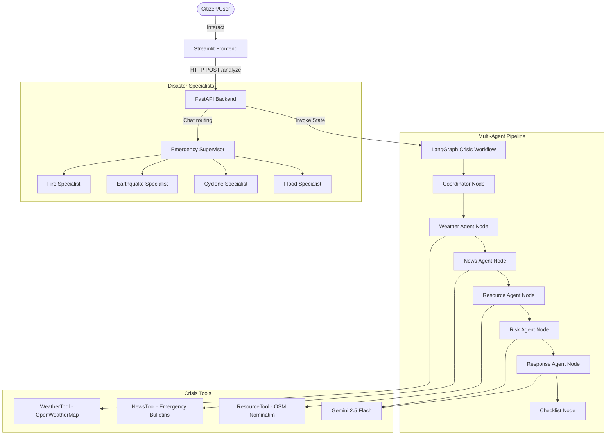

# CrisisGuardian AI - Architecture Documentation

CrisisGuardian AI is a premium multi-agent disaster response assistant designed to deliver high-quality, actionable, and rapid instructions during physical threats like floods, cyclones, earthquakes, and fires.

## System Topology

## Module Architecture

### 1. Base Agent Framework (`agents/base_agent.py`)
- Employs `ChatGoogleGenerativeAI` wrapper powered by the `gemini-2.5-flash` model.
- Standardizes parameter settings (default temperature of 0.2 for precise, fact-based response generation).

### 2. Specialized Disaster Agents (`agents/disaster_agents.py`)
- **FloodResponseAgent**: Route safety, vertical evacuation, utility mitigation.
- **CycloneResponseAgent**: Window protection, storm shelters, post-storm warnings.
- **EarthquakeResponseAgent**: Drop-Cover-Hold rules, aftershock safety.
- **FireResponseAgent**: Escape pathing, wildfire evacuation protocols.
- **EmergencySupervisorAgent**: Classifies requests and routes to specialists.

### 3. Crisis Workflow (`workflows/crisis_workflow.py`)
- Powered by `LangGraph` with 7 sequential nodes: Coordinator → Weather → News → Resource → Risk → Response → Checklist.
- State includes location, crisis type, gathered data, risk assessment, and final guidance.

### 4. Crisis Tools (`tools/`)
- **WeatherTool**: OpenWeatherMap integration with alert generation.
- **NewsTool**: Disaster news and emergency broadcast retrieval.
- **ResourceTool**: OSM Nominatim geocoding for shelters, hospitals, and emergency services.
- **disaster_tools.py**: LangChain `@tool` wrappers for weather alerts, earthquakes, shelters, and SOS.

### 5. Backend Server API (`backend/api.py`)
- FastAPI service layer running on Uvicorn via `main.py`.
- Endpoints: `/health`, `/analyze`, `/resources`, `/document-analysis`, `/document-query`, `/api/sos`, `/system-status`, `/agent-status`.
- Integrated with `error_handling.py` for offline fallback responses and `logging_config.py` for centralized logging.

### 6. Frontend (`frontend/`)
- Streamlit multi-page dashboard with glassmorphic dark theme.
- Pages communicate with the FastAPI backend for disaster analysis, resource lookup, document RAG, and system monitoring.
